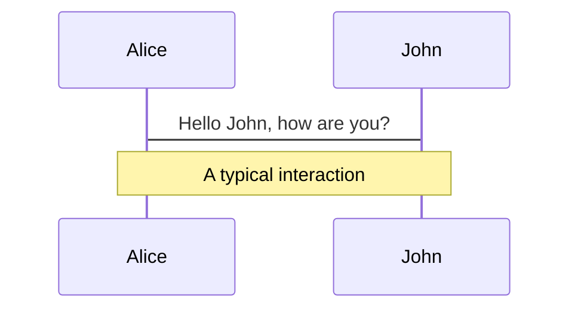
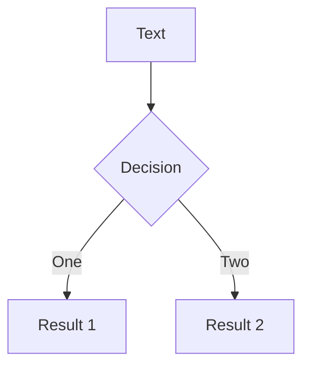
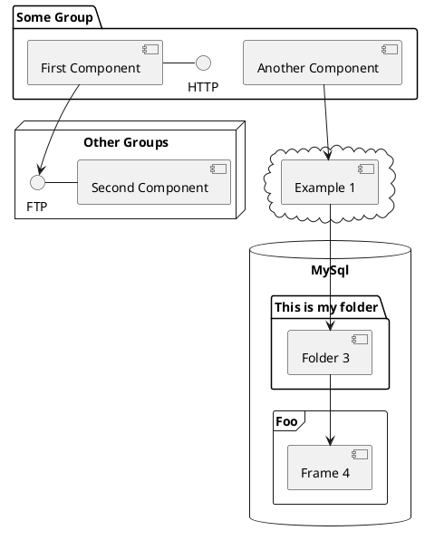

---
# try also 'default' to start simple
theme: penguin
# random image from a curated Unsplash collection by Anthony
# like them? see https://unsplash.com/collections/94734566/slidev
background: https://source.unsplash.com/collection/94734566/1920x1080
# apply any windi css classes to the current slide
class: 'text-center'
# https://sli.dev/custom/highlighters.html
highlighter: prism
# show line numbers in code blocks
lineNumbers: false
# some information about the slides, markdown enabled
info: |
  ## Slidev Starter Template
  Presentation slides for developers.

  Learn more at [Sli.dev](https://sli.dev)
# persist drawings in exports and build
drawings:
  persist: false
layout: intro
---


# Introduction to Frontend Development

Presentation slides for developers

<div class="pt-12">
  <span @click="$slidev.nav.next" class="px-2 py-1 rounded cursor-pointer" hover="bg-white bg-opacity-10">
    Press Space for next page <carbon:arrow-right class="inline"/>
  </span>
</div>

<div class="abs-br m-6 flex gap-2">
  <button @click="$slidev.nav.openInEditor()" title="Open in Editor" class="text-xl icon-btn opacity-50 !border-none !hover:text-white">
    <carbon:edit />
  </button>
  <a href="https://github.com/zuramai/talks" target="_blank" alt="GitHub"
    class="text-xl icon-btn opacity-50 !border-none !hover:text-white">
    <carbon-logo-github />
  </a>
</div>

<!--
The last comment block of each slide will be treated as slide notes. It will be visible and editable in Presenter Mode along with the slide. [Read more in the docs](https://sli.dev/guide/syntax.html#notes)
-->

---
layout: presenter
presenterImage: https://saugi.me/images/ogi.png
class: grid  align-self-center justify-self-center
---

# Ahmad Saugi
Open-source Frontend Developer
- Currently studying at <fancy-link href="https://binus.ac.id/">Binus University</fancy-link>
- Portfolio <fancy-link href="https://saugi.me">saugi.me</fancy-link>
- Say hi at <fancy-link href="https://instagram.com/asawgi">@asawgi</fancy-link>

<!--
141
-->

---

# Rangkaian workshop hari ini:
- Instalasi software prasyarat 
- Berkenalan dengan dunia frontend development
- Roadmap menjadi frontend developer yang baik dan benar
- Membuat website portofolio sederhana
- QnA

---
class: "text-center flex items-center"
---
# Apa aja sih yang perlu dipersiapkan?

<style>
.big-logos svg {
width: 100px;
height: 100px;
}
</style>
<div grid="~ cols-2 gap-x-10 gap-y-10" class="text-center">
  <div class="big-logos"><akar-icons-vscode-fill class="inline-block"/></div>
  <div>
    <div class="flex justify-center gap-3 big-logos">
      <logos-firefox/><logos-chrome/><logos-brave/><logos-microsoft-edge/>
    </div>
  </div>
  <div>Visual Studio Code</div>
  <div>Browser favorit kamu (Firefox/Chrome/Dll)</div>
</div>

---
layout: text-image
media: /images/ui.webp
class: "flex items-center"
---

# Kenalan dengan Frontend Development
*Front-end web development* adalah pengembangan situs web yang akan disajikan langsung kepada pengguna melalui penggunaan HTML, CSS, dan JavaScript, sehingga pengguna dapat melihat dan berinteraksi dengan situs web tersebut.

---

# Roadmap 
https://roadmap.sh
<Roadmap/>

---
layout: center
---
# Jadi, apakah semuanya perlu dipelajari?

<v-click class='text-center'>

<p class="text-center">Tentu tidak</p>

</v-click>
---


# Spesialisasi di Front-end development

| Game dev | UI Design | Creative | Software Engineer | System Engineer | 
| --- | --- | --- | --- | --- |
| <ul><li>ThreeJS</li><li>PixiJS</li><li>BabylonJS</li></ul> | <ul><li>SASS</li><li>Bootstrap</li><li>TailwindCSS</li><li>PostCSS</li></ul> | <ul><li>HTML5 Canvas</li><li>WebGL</li><li>SVG</li><li>GSAP</li></ul> | <ul><li>Vue</li><li>React</li><li>Angular</li></ul> | WebAssembly

---
layout: iframe

# the web page source
url: https://bruno-simon.com/
---


---
layout: new-section
class: "flex items-center justify-center" 
---
<ri-html5-fill class="mx-auto text-6xl"/>

# HTML5

---
layout: image-left
class: "flex  flex-col justify-center"
image: >-
  https://www.freecodecamp.org/news/content/images/size/w2000/2020/01/html-examples.jpeg
---

# Apa itu HTML?
HTML adalah singkatan dari **HyperText Markup Language**.

<v-click>

Ya, HTML adalah bahasa markup, bukan bahasa pemrograman.

</v-click>

<!--
Seperti yang bisa kalian lihat di gambar disamping, itu adalah contoh kode HTML.

HTML adalah bahasa markup, yaitu bahasa yang digunakan untuk menstruktur sebuah dokumen.
-->

---

# Basic HTML

HTML terdiri dari kumpulan **_tag_** yang terdiri dari _tag_ pembuka dan penutup.

```html
<!DOCTYPE html>
<html>
<head>
    <title>Judul yang akan ditampilkan di tab browser</title>
</head>
<body>
    <p>Teks kamu akan muncul disini</p>
</body>
</html>
```

<hr class="mt-5"/>

<v-click>

Tag HTML itu terdiri dari pembuka dan penutup.

`<p> Hello World </p>`

<ic-round-arrow-right-alt style="color:red; rotate: 270deg; margin: -30px 0;display:inline-block" height="100" width="40"/>
<ic-round-arrow-right-alt style="color:red; rotate: 270deg; margin: -30px 120px; display:inline-block" height="100" width="40"/>
<br/>

Ini tag pembuka &nbsp;&nbsp;&nbsp;&nbsp;&nbsp;&nbsp;&nbsp;Ini tag penutup

</v-click>

---

# HTML Tags

HTML terdiri dari bermacam-macam **_tag_**. 

<div grid="~ cols-2">

| Tag | Sebagai |
| --- | ------- |
| `<p>` | Paragraf |
| `<h1>` | Heading 1 |
| `<h2>` | Heading 2 |
| `<h3>` | Heading 3 |
| `<h4>` | Heading 4 |
| `<h5>` | Heading 5 |
| `<h6>` | Heading 6 |
| `<strong>` | Bold |

| Tag | Sebagai |
| --- | ------- |
| `<ul>` | List |
| `<ol>` | List |
| `<li>` | List |
| `` | Menampilkan gambar |
| `<a>` | Link |
| `<div>` | Pembagian |
| `<br>` | Membuat baris baru |

</div>
---
layout: image-right
image: https://source.unsplash.com/collection/94734566/1920x1080
---

# CSS

Ada 3 cara untuk menuliskan CSS. Antara lain:

- Inline CSS
- Internal CSS
- External CSS

---

<div grid="~ cols-2">

<h1>Inline CSS</h1>
<h1 v-click="1">Internal CSS</h1>

<div class="pr-5">

  Inline CSS adalah code css yang ditulis secara langsung pada elemen HTML. 

  Contoh:

  ```html
  <p style="color: red">Text warna merah</p>
  ```
</div>

<div v-click="1">

  Internal CSS adalah code css yang ditulis pada tag `<style>`, dan di dalam tag `<head>`.

  Contoh:

  ```html
  <head>
  <style>
    p {
      color: red;
    }
  </style>
  </head>
  <body>
    <p>Text warna merah</p>
  </body>
  ```
</div>

</div>

---


<h1>External CSS</h1>

External CSS adalah code css yang ditulis pada sebuah file berekstensi .css.

Contoh:

<div class="grid grid-cols-[1fr,1fr]">

<div class="pr-5">


File `index.html`
```html {all|4}
<!DOCTYPE html>
<html>
  <head>
    <link rel="stylesheet" type="text/css" href="style.css" />
  </head>

  <body>
    <h1>Judul</h1>
    <p>Paragraf</p>
  </body>
</html>
```

<arrow v-click="1" x1="420" y1="450" x2="350" y2="350" color="red" width="3" arrowSize="1" />


</div>

<div>

File `style.css`
```css
h1 {
  font-size: 16px;
}

p {
  color: red;
}

```
</div>

</div>
---

# Components

<div grid="~ cols-2 gap-4">
<div>

You can use Vue components directly inside your slides.

We have provided a few built-in components like `<Tweet/>` and `<Youtube/>` that you can use directly. And adding your custom components is also super easy.

```html
<Counter :count="10" />
```

<!-- ./components/Counter.vue -->
<Counter :count="10" m="t-4" />

Check out [the guides](https://sli.dev/builtin/components.html) for more.

</div>
<div>

```html
<Tweet id="1390115482657726468" />
```

<Tweet id="1390115482657726468" scale="0.65" />

</div>
</div>


---
class: px-20
---

# Themes

Slidev comes with powerful theming support. Themes can provide styles, layouts, components, or even configurations for tools. Switching between themes by just **one edit** in your frontmatter:

<div grid="~ cols-2 gap-2" m="-t-2">

```yaml
---
theme: default
---
```

```yaml
---
theme: seriph
---
```


</div>

Read more about [How to use a theme](https://sli.dev/themes/use.html) and
check out the [Awesome Themes Gallery](https://sli.dev/themes/gallery.html).

---
preload: false
---

# Animations

Animations are powered by [@vueuse/motion](https://motion.vueuse.org/).

```html
<div
  v-motion
  :initial="{ x: -80 }"
  :enter="{ x: 0 }">
  Slidev
</div>
```

<div class="w-60 relative mt-6">
  <div class="relative w-40 h-40">
    
    
    
  </div>

  <div
    class="text-5xl absolute top-14 left-40 text-[#2B90B6] -z-1"
    v-motion
    :initial="{ x: -80, opacity: 0}"
    :enter="{ x: 0, opacity: 1, transition: { delay: 2000, duration: 1000 } }">
    Slidev
  </div>
</div>

<!-- vue script setup scripts can be directly used in markdown, and will only affects current page -->
<script setup lang="ts">
const final = {
  x: 0,
  y: 0,
  rotate: 0,
  scale: 1,
  transition: {
    type: 'spring',
    damping: 10,
    stiffness: 20,
    mass: 2
  }
}
</script>

<div
  v-motion
  :initial="{ x:35, y: 40, opacity: 0}"
  :enter="{ y: 0, opacity: 1, transition: { delay: 3500 } }">

[Learn More](https://sli.dev/guide/animations.html#motion)

</div>

---

# LaTeX

LaTeX is supported out-of-box powered by [KaTeX](https://katex.org/).

<br>

Inline $\sqrt{3x-1}+(1+x)^2$

Block
$$
\begin{array}{c}

\nabla \times \vec{\mathbf{B}} -\, \frac1c\, \frac{\partial\vec{\mathbf{E}}}{\partial t} &
= \frac{4\pi}{c}\vec{\mathbf{j}}    \nabla \cdot \vec{\mathbf{E}} & = 4 \pi \rho \\

\nabla \times \vec{\mathbf{E}}\, +\, \frac1c\, \frac{\partial\vec{\mathbf{B}}}{\partial t} & = \vec{\mathbf{0}} \\

\nabla \cdot \vec{\mathbf{B}} & = 0

\end{array}
$$

<br>

[Learn more](https://sli.dev/guide/syntax#latex)

---

# Diagrams

You can create diagrams / graphs from textual descriptions, directly in your Markdown.

<div class="grid grid-cols-3 gap-10 pt-4 -mb-6">







</div>

[Learn More](https://sli.dev/guide/syntax.html#diagrams)


---
layout: center
class: text-center
---

# Learn More

[Documentations](https://sli.dev) · [GitHub](https://github.com/slidevjs/slidev) · [Showcases](https://sli.dev/showcases.html)
